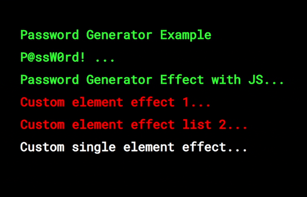

# Password Generator Effect JS





#### How to use

1) import javascript file

```html
<script src="password-effect.js"></script>
```

2) give a html element class "password-generator-effect"

Example: 

```html
<div class="password-generator-effect">Password Generator Example</div>
```

Or you can use custom html elements

Example 1:

```html
<div id="custom-one-element">Custom single element effect...</div>
```

```javascript
let element = document.querySelector("#custom-one-element");
element.passwordGeneratorEffect({
    randomiseSpeed: 100,
    clearSpeed: 5000
});
// you can use default values:
// element.passwordGeneratorEffect();
```


Example 2:

```html
<div class="custom-class">Custom element effect 1...</div>
<div class="custom-class">Custom element effect list 2...</div>
```

```javascript
let elements = Array.from(document.querySelectorAll(".custom-class"));
elements.passwordGeneratorEffect({
    randomiseSpeed: 300, // is a randomization multiplier of each character in ms
    clearSpeed: 500 // effect animation time in ms
});
// you can use default values:
// elements.passwordGeneratorEffect();
```


#### Github Page

https://halid-senyigit.github.io/Password-Generator-Effect-JS/


#### Licence

MIT 